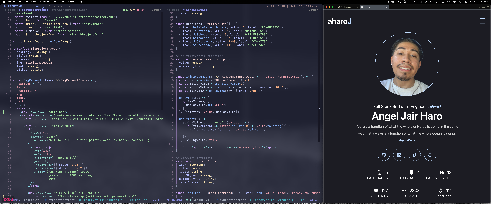
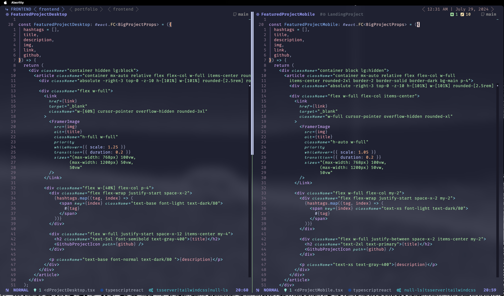

<!-- START -->
<h1 align="center"><b> Angel J. Haro 


</h1>



> Responsive and Adaptive Code for iPhone, iPad, Desktop, and Ultrawide Displays



# How To Run

## Frontend

1. Clone

```sh
git clone https://github.com/aharoJ/portfolio.git
```

2. CD into path

../../portfolio

3. clean and install dependencies

```sh
npm install --force
```

4. Run in your local enviroment

```sh
 npm run dev
```

---

## Backend

- No backend integration rebase yet.

# Technologies Used

- TypeScript
- Next.js 14
- Tailwind CSS
- Framer Motion
- React Icon
